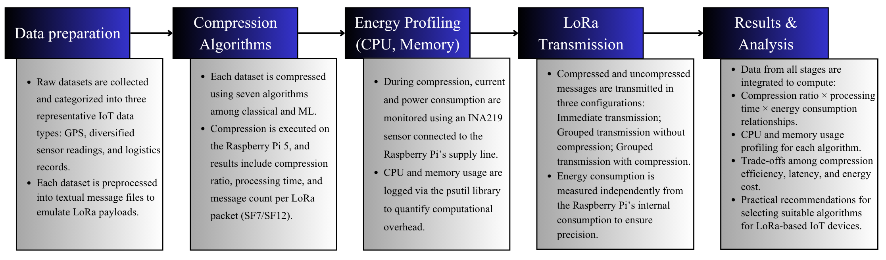
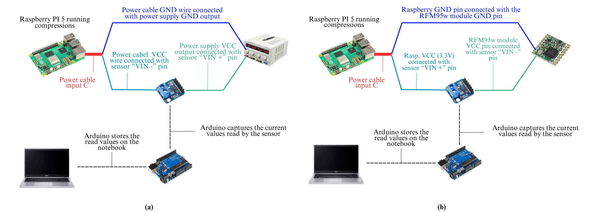
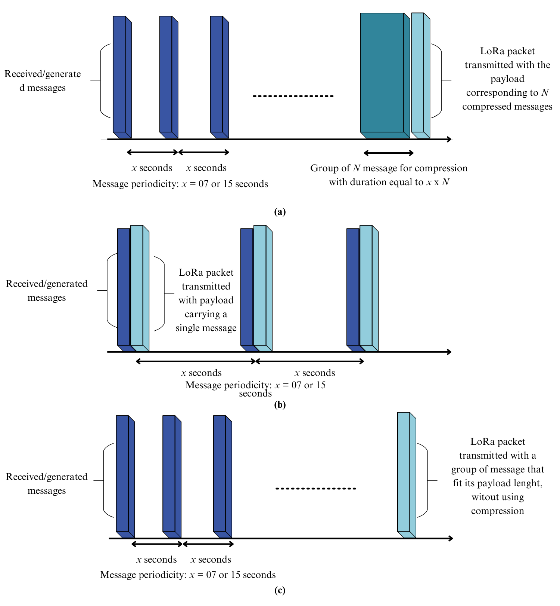

# **LoRa-Based IoT Data Compression and Energy Profiling**

This repository contains all source codes, scripts, and configuration files used in the development of the scientific article that investigates the impact of **lossless data compression algorithms**—both classical and machine-learning-assisted—on **energy efficiency and transmission performance** in **LoRa-based IoT networks**.

The work was conducted on a **Raspberry Pi 5** integrated with an **RFM95W LoRa module** and an **INA219 current sensor** connected to an **Arduino Uno** for real-time power measurement.

---

## 📘 **Overview**

This study explores how **data compression** can reduce the **payload size** and **airtime** of LoRa transmissions, leading to lower energy consumption and better bandwidth usage.
The experiments were divided into three major stages:

1. **Data Preparation** – Processing GPS, IoT sensor, and logistics datasets into textual message files simulating LoRa payloads.
2. **Compression Algorithms** – Applying seven lossless compressors (classical and ML-based).
3. **Energy Profiling & LoRa Transmission** – Measuring CPU, memory, and energy usage during compression and LoRa transmissions.

The workflow below summarizes the process:



---

## ⚙️ **Algorithms Implemented**

### **1. Huffman Coding**

A classical **entropy-based** compression algorithm that assigns shorter binary codes to frequent symbols and longer ones to rare symbols.
The implementation in this repository uses **dynamic trees**, built according to symbol frequencies in the dataset.

* **Main features:**

  * Frequency table generation from the ASCII symbols in each dataset.
  * Adapted for three configurations: mixed alphanumeric data, GPS numeric data, and logistics codes.
  * Executed on the Raspberry Pi 5 for compression profiling.

#### **How to compile and run**

Inside the folder `Configuração_Huffman`, compile using the following commands:

```bash
# For alphanumeric datasets (uppercase, lowercase, and numbers)
g++ -o huffman_exec Arvore_bin.cpp Compress.cpp Lista.cpp main.cpp tabela_mani.cpp

# For GPS datasets (numeric and special characters)
g++ -o huffman_gps Arvore_bin.cpp Compress.cpp Lista.cpp main.cpp tabela_mani.cpp -DGPS

# For logistics datasets (alphanumeric)
g++ -o huffman_log Arvore_bin.cpp Compress.cpp Lista.cpp main.cpp tabela_mani.cpp -DLOG
```

---

### **2. LZW (Lempel–Ziv–Welch)**

A **dictionary-based** compression algorithm that replaces repeated sequences with dictionary references.
It is lightweight and efficient, making it highly suitable for IoT environments with limited resources.

#### **How to compile and run**

Inside the folder `Configuração_LZW`, compile using:

```bash
g++ -o lzw_exec Compress.cpp Lista.cpp main.cpp
```

This executable can compress **any type of file** used in the experiments (GPS, IoT, or logistics data).

---

### **3. PAQ8PX**

A **context-mixing** statistical compressor that predicts each bit's probability using hundreds of context models.
It uses adaptive probability maps (APMs) and neural network weight updates to refine predictions.

* **Advantages:** High compression ratio on text and structured data.
* **Disadvantages:** Computationally intensive and memory demanding.
* **Source:** [PAQ8PX repository](https://github.com/hxim/paq8px)

---

### **4. CMIX**

A **hybrid probabilistic-neural compression algorithm** that integrates a **Gated Linear Network (GLN)** and an **LSTM** for byte-level mixing.
It combines over 2000 models for symbol prediction and uses **secondary symbol estimation (SSE)** for final refinement.

* **Key characteristics:**

  * Implements adaptive context mixing.
  * Requires reduced PPM buffer size to run on Raspberry Pi 5.
  * Tested using CMIX v20.
* **Source:** [CMIX official repository](https://github.com/byronknoll/cmix)

---

### **5. GMIX**

The **successor of CMIX**, developed to improve modularity and memory serialization (checkpointing).
It generalizes across data types and supports disabling learning for generation mode.

* **Implemented as a CPU-based tool** that doesn’t require GPUs.
* **Source:** [GMIX repository](https://github.com/byronknoll/gmix)

---

### **6. LSTM-compress**

A **purely neural** compression algorithm that employs only the **LSTM** component from CMIX architecture.
It learns long-term dependencies in sequences and uses arithmetic coding for bit encoding.

* **Advantages:** Demonstrates how sequential neural learning can perform data compression.
* **Limitations:** Slower and less efficient than hybrid models like CMIX.
* **Source:** [LSTM-compress repository](https://github.com/byronknoll/lstm-compress)

---

### **7. BSC-m03**

A **block-sorting** compressor based on the **Burrows–Wheeler Transform (BWT)**, optimized for 64-bit systems.
It supports multicore processing and in-place compression/decompression, achieving high speed and integrity with CRC-32 checks.

* **Source:** [BSC project](https://github.com/IlyaGrebnov/libbsc)

---

## 🔬 **Hardware and Measurement Setup**

The experiments were performed on the following hardware setup:

* **Raspberry Pi 5**: runs compression algorithms and LoRa transmissions.
* **RFM95W LoRa module**: transceiver for 915 MHz communication.
* **INA219 sensor**: measures real-time current and voltage.
* **Arduino Uno**: reads INA219 sensor data and logs to a connected laptop.
* **Minipa MPC-3005 power supply**: adjustable dual power output.

### **(a) Compression Energy Measurement Setup**



### **(b) LoRa Transmission Measurement Setup**



All energy data were collected in real time and processed using Python scripts on the Raspberry Pi 5.

---

## 📡 **LoRa Transmission Scripts**

The folder `transmissão_LoRa` contains the Python scripts for configuring and managing **LoRa transmissions** using the **RFM95W** module.

* To change the **spreading factor (SF)**, modify the initialization line:

  ```python
  modulo = start_lora(SF=7)  # Use SF=12 for higher range and lower data rate
  ```
* Both transmitter and receiver must use the **same SF value**, or communication will fail.
* The scripts support **SF7** and **SF12** by default but can be modified for other values.

---

## 📊 **Execution Scenarios**

1. **Scenario 01 – Compression Rate & Time**
   Measures the average compression ratio, processing time, and number of messages that fit in a single LoRa packet (222 bytes for SF7 and 51 bytes for SF12).

2. **Scenario 02 – Energy Consumption**
   Monitors current and voltage during compression using the INA219 sensor.
   The `psutil` Python library logs CPU and memory usage.

3. **Scenario 03 – Transmission Efficiency**
   Compares energy consumption for compressed vs. uncompressed packets under three conditions:

   * Immediate transmission (no grouping).
   * Grouped messages without compression.
   * Grouped messages with compression.

---

